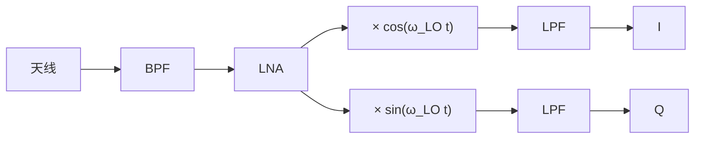

# 图解：Mixer 与 I/Q（步骤版）

> 读法：每一步只有 **一张图 + 几句图注**。公式只当图边小字，可先跳过。  
> 进阶：[[概念-Mixer变频与镜像频率]]

---

## 零中频接收机框图（I/Q）

来自课件截图，已存入附件：

![[图-零中频接收机-IQ框图.png]]

**图注（对应框图从左到右）**

| 模块 | 作用 |
|------|------|
| 天线 + BPF | 收射频；BPF 压带外（零中频里不主要靠它消镜像） |
| LNA | 低噪放 |
| 分两路 × cos / × sin | 正交本振混频；图中 $\omega_{LO}=\omega_s$ → **零中频** |
| LPF | 滤掉和频等，留基带 |
| I / Q | 两路模拟基带 → 后接 ADC → 数字 $z=I+jQ$ |



---

## 总览：信号一生（收）


AD9361 片内：Mixer 之后还有 TIA、三阶 BB LPF，再 ADC；和上图「LPF → I/Q」同一思想，只是级数更多。

---

## 步骤 1：天线上只有「一路」

```text
        天线
          │
          ▼
     模拟电压 x(t)          ← 只有一根（实信号）
```

频谱数学上 **+f 与 −f 成对**，没有天生的 I/Q。

---

## 步骤 2：Mixer = 乘法，频率搬家

```text
 x(t) ──× cos(ω_LO·t)── LPF ──→ 差频（要）
              LO                和频（滤掉）
```

例：$f_{RF}=10\,\mathrm{GHz}$，$f_{LO}=9.5\,\mathrm{GHz}$ → 差频 $500\,\mathrm{MHz}$。  
小字：$\cos\omega_{RF}t\cos\omega_{LO}t=\frac12\cos(\omega_{RF}-\omega_{LO})t+\frac12\cos(\omega_{RF}+\omega_{LO})t$

---

## 步骤 3：镜像——两个 RF，同一个 IF

LO=100 MHz 时，**83 MHz 与 117 MHz** 都差出 17 MHz。

```text
 83 MHz ─┐
         ├── 都变成 17 MHz → 实混频后分不清
117 MHz ─┘
```

超外差用 RF BPF 二选一；零中频镜像贴到信号上，改靠 I/Q。

---

## 步骤 4：为什么要 I、Q 两路

```text
        Q ↑     ● (I,Q) 二维坐标
          |    /
          |   /
          └──────→ I
```

- 只采 I：一维投影，上下边带像同一个信号  
- 采 I+Q：复数 $z=I+jQ$，带旋转方向，边带可分  

**不是采两遍同一信号，是要两维坐标。**

数字：

```text
z[n] = I[n] + j*Q[n]
```

复频谱上 +f 与 −f 独立 → FFT 能看出两侧、可只保留有用侧。

---

## 步骤 5：Mixer 后的两级 LPF（各滤什么）

```text
Mixer → [TIA + 一阶 LPF] → [BB LPF 三阶] → ADC
         粗滤：和频/远端      精滤 + 抗混叠
```

| 级 | 类型 / 角点 | 主要滤掉 |
|----|-------------|----------|
| **TIA LPF** | 单极点，~2.5×BBBW | ① 混频**和频**（约 $2f_{RF}$）② 远端杂散 ③ 带外宽带噪声（防后级过载） |
| **Rx BB LPF** | 三阶 Butterworth，~1.4×BBBW | ① **邻道/带外干扰** ② 通带外残留噪声 ③ **ADC 抗混叠** |

```text
频率轴示意（零中频）

  和频(2f_RF)          通道附近
  ↓ 很远                ↓
  █····················████·····→ f
  TIA 一阶先压掉     BB 三阶收干净 → ADC
```

| 不靠这两级解决 | 靠什么 |
|----------------|--------|
| 镜像（上/下边带） | I/Q + Quad Cal |
| LO 泄漏 / 直流 | RF DC Cal、BB DC Cal |

发射侧对称：DAC → **Tx BB LPF**（三阶，~1.6×BBBW，滤 DAC 镜像）→ **Tx 二级 LPF**（单极点，~5×BBBW，压带外噪声）→ Mixer。

零中频**没有 IF 带通**，选频靠基带低通 + I/Q，不靠中频 BPF。

---

## 步骤 6：常见误解

| 误解 | 正确理解 |
|------|----------|
| LO=RF 就没有镜像 | 仍有镜像，变成 ±f 折叠，要 I/Q |
| I 和 Q 是同一信号 | 同一来源的正交投影，不是同一条波形 |
| 进了数字域就自动消镜像 | 是 I/Q 保住了信息，数字才能区分 |

---

## 步骤 7：OFDM 时（可选）

```text
数字 I/Q（时域）→ 去CP + FFT → 频域子载波 → 均衡 → 星座 → 比特
```

单载波也可在时域解调，不是所有系统都必须 FFT。

---

## 口诀

```text
天线一路实信号，
混频搬家分差和；
镜像对称难滤掉，
I、Q 两路定坐标；
TIA 粗滤 BB 精，
零中频靠正交保；
数字仍是时域点，
OFDM 再进频域解调。
```

---

## 相关

- 进阶：[[概念-Mixer变频与镜像频率]]
- 框图附件：`90-Attachments/图-零中频接收机-IQ框图.png`
- [[图-AD9361-TX-RX路径硬件模块.excalidraw]]
- [[概念-锁相环PLL与VCO]]
- [[资源-AD9361-寄存器文档]]
- [[MOC-射频]]
