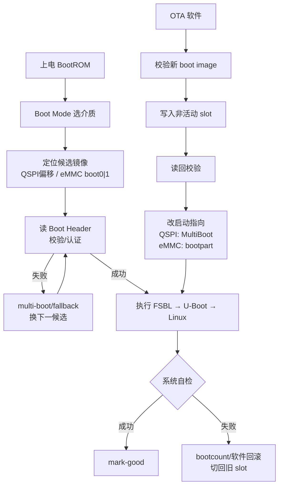

# Bootloader 分区与启动 Slot 切换 — 面试问答

> 适用：嵌入式 Linux / Zynq / 驱动与系统启动相关岗位  
> 结构：每题 **口头答案** + **关键点** + **易被追问**  
> 与《Linux驱动加载与匹配-面试问答.md》配套：那份讲 insmod→probe，这份讲上电→BootROM→双引导→OTA

---

## 速记总览

| 主题 | 一句话结论 |
|------|------------|
| 分区设计目标 | 可升级、可回滚、可救砖、数据与系统分离 |
| 升级断电 | 先写镜像、后改元数据；只写非活动区；元数据双份+CRC |
| Zynq 启动链 | BootROM → FSBL（+PL）→ U-Boot → Linux |
| bootloader 双份 | 防变砖；kernel 坏还能回退，引导坏了则可能整板砖 |
| BootROM 如何选双份 | 不认文件名；QSPI 看偏移/multi-boot，eMMC 看 boot0/1 + EXT_CSD |
| Boot Header 作用 | 校验并加载**当前这份**镜像；一般不当“目录”去找备份偏移 |
| multi-boot 配置在哪 | boot.bin 元数据 + 介质布局 + 运行时寄存器（如 SLCR MultiBoot / CSU multi_boot）+ 可选 eFUSE |
| eMMC 双 boot 配置（通用） | EXT_CSD[179] BOOT_PARTITION_ENABLE；写 boot0/1 用 dd/`mmc`/U-Boot |
| eMMC 双 boot 配置（本项目） | 用户区 p1/p2/p3 + 文件名 + **CSU multi_boot 0xFFCA0010**，非 EXT_CSD |
| 主动切 slot | 写非活动区→校验→改启动指向→复位→mark-good / 失败回滚 |
| QSPI vs eMMC 切换 | QSPI：MultiBoot 偏移；eMMC：bootpart/partconf 或 slot 号寄存器；env 不会被 BootROM 读 |

**三条硬结论：**
1. BootROM **只认约定位置 + 合法 Boot Header**，不认 `boot_backup.bin` 这类名字。  
2. **Header 管加载这一份**；**选哪一份**靠 multi-boot 偏移 / eMMC boot 分区配置。  
3. 软件切换 slot 的本质：**非活动写入 + 最后才改启动指向 + 可回滚确认**。

---

## 1. Bootloader 分区怎么设计？

### 口头答案

设计目标是可升级、可回滚、可救砖、用户数据不丢。常见做法：bootloader（FSBL+U-Boot，常打包 `boot.bin`）做 **primary/golden 双份**；U-Boot env 双份；boot 元数据/分区选择可切换；kernel/rootfs 可做 A/B；`data` 独立；预留 recovery 或线刷手段。Zynq 上还要区分：BootROM 只读 Boot Image，U-Boot 之后才认 SD/eMMC 文件系统分区。

### 关键点

```text
典型布局（示意）
├── QSPI: boot primary + boot golden + env×2
├── eMMC boot0/boot1: 两份 boot image
├── eMMC user / SD: kernel + rootfs A/B + data
└── recovery / 线刷（JTAG、USB DFU 等兜底）
```

| 分区 | 作用 |
|------|------|
| bootloader 双份 | 引导链冗余，OTA 不覆盖唯一启动路径 |
| env 双份 | `saveenv` 写坏仍可启动 |
| boot0/boot1 或 QSPI 双偏移 | 启动镜像 A/B |
| data | 配置与用户数据，一般不随系统升级覆盖 |

### 易被追问

- 为何 bootloader 优先双份？→ 它坏了没有“上一级软件”回退  
- 与 rootfs A/B 关系？→ A/B 管系统回滚；bootloader 双份管“还能不能进入回滚”

---

## 2. 升级过程断电/断点如何处理？

### 口头答案

核心是 **先写镜像、后改元数据；只动非活动分区；失败可检测、可回滚**。写镜像时断电不影响当前系统；元数据双份 + magic/CRC/序号，坏一份用另一份；切到新系统后用 bootcount 限制尝试次数，失败自动回旧 slot。网络下载断线用分块续传 + 校验，不要边下边盲目覆盖唯一可启动区。

### 关键点

| 断电位置 | 结果 |
|----------|------|
| 写非活动 slot 中 | 当前系统不受影响 |
| 镜像写完、启动指向未改 | 仍从旧 slot 启动 |
| 启动指向写坏 | 元数据双份 / 默认回 golden |
| 新 slot 启动失败 | bootcount 超限回滚 |

### 易被追问

- 元数据如何原子？→ 双份存储，先写备用再选合法且序号大者  
- boot.bin 写一半切到新偏移？→ 禁止；必须读回校验后再切换指向

---

## 3. 以 Zynq 介绍启动链与分区

### 口头答案

Zynq 上电后：**BootROM（片内 ROM，不可改）→ FSBL（MIO/时钟/DDR，可选配置 PL）→ U-Boot → Linux**。BootROM 按 Boot Mode 引脚选介质（QSPI/SD/eMMC…），读 **Boot Image（boot.bin）**，用其中的 Boot Header 加载 FSBL。双 bootloader 主要指 QSPI 两个偏移或 eMMC boot0/boot1 两份 boot image；SD/eMMC 用户区再放 kernel/rootfs 与 data。

### 关键点

```text
boot.bin（概念结构）
├── Boot Header
├── FSBL
├── Bitstream（可选）
├── U-Boot
└── 后续分区 / 配套镜像
```

```text
QSPI:  offset0 primary + offset golden + env
eMMC:  boot0/boot1（boot image） + user（系统与数据）
```

### 易被追问

- FSBL 和 U-Boot 谁更关键？→ FSBL 更靠前；只双份 U-Boot、FSBL 单份仍可能砖  
- BootROM 读 Linux 分区吗？→ 不读；只认 Boot Image/Header（及 boot 分区选择）

---

## 4. Bootloader 双份有什么意义？

### 口头答案

意义是 **防变砖 + 支持安全 OTA + 远程可恢复**。kernel/rootfs 坏了，旧 bootloader 仍能切回旧系统；bootloader 坏了，BootROM 读不到合法 FSBL 就会卡死。因此要用 primary/golden 双份 boot image，升级只写非活动副本，校验通过后再改启动指向；失败时 BootROM 或软件回退到 golden。

### 关键点

| 对比 | 单份 | 双份 |
|------|------|------|
| boot.bin 写坏 | 高概率变砖 | golden 可启动 |
| FSBL/U-Boot bug | 只能 JTAG/线刷 | 回退旧引导 |
| 配合 rootfs A/B | 回滚机制本身可能起不来 | 引导层仍可用 |

### 易被追问

- 双份会不会占满 Flash？→ 按 FSBL+PL+U-Boot 体积规划 bank  
- JTAG 能否替代双份？→ 不能量产替代；双份是不开盖自动恢复

---

## 5. 双 bootloader 时 BootROM 如何区分不同的 boot.bin？

### 口头答案

**不按文件名区分。** QSPI 上按 **线性地址偏移**；eMMC 上按 **硬件 boot0/boot1 分区** + EXT_CSD 启动选择。每个位置都必须是 **完整的合法 Boot Image（合法 Header）**。BootROM 先按策略定位候选位置，再读该处 Header 做校验；失败则按 multi-boot 规则换下一候选。

### 关键点

```text
QSPI:  0x0 primary | 0x6xxxx golden   → 看偏移
eMMC:  boot0 | boot1                   → 看分区 + BOOT_PARTITION_ENABLE
SD FAT: 通常只认约定名 BOOT.BIN        → 不会自动找 boot_backup.bin
```

### 易被追问

- 用户区里 `boot.bin` 和 `boot_bak.bin`？→ BootROM 默认不识别 backup 名  
- 双份放在哪更合理？→ boot 链放 QSPI/eMMC boot 区；用户区可做 rootfs A/B

---

## 6. QSPI 线性地址空间：BootROM 怎么知道 offset？

### 口头答案

QSPI 对 BootROM 是线性 Flash 地址，没有目录和文件名。上电后它先读 **启动模式写死的默认偏移**（常见 0）上的 Boot Header。失败后的下一偏移来自：**器件 multi-boot 搜索规则、烧写的启动配置、运行时寄存器（如 Zynq-7000 SLCR MultiBoot）** 等，**不是**扫描 Flash 发现文件，也 **不读** U-Boot env / Linux 配置。

### 关键点

```text
BootROM 知道的候选地址 =
    ① 启动模式默认起始偏移（硅片/BootROM 规定）
  + ② multi-boot/fallback 配置（启动元数据、efuse 等）
  + ③ 复位前写入、复位后仍可见的硬件寄存器
```

工程含义：只在 `0x600000` 写了 golden，**若无任何配置指向它，BootROM 不知道 0x600000**。

### 易被追问

- 为何第一次一定去 0x0？→ 默认候选由 BootROM/启动模式规定  
- 上电后 MultiBoot 还在吗？→ 常见掉电清零；软复位类型才可能采样软件写入值（查 TRM）

---

## 7. Multi-boot 配置怎么配？配置到哪里？

### 口头答案

multi-boot **不是**单一文件，而是分层的：

1. **boot.bin（BootGen+BIF）**：Header、分区加载、校验/签名等元数据  
2. **介质布局**：QSPI 各偏移 / eMMC boot0/1 上放合法镜像  
3. **运行时寄存器**：如 Zynq-7000 **SLCR MultiBoot**，软件写入下次偏移后再约定复位  
4. **eFUSE**：安全启动/防回滚等，通常不存“golden 文件名”  
5. **软件策略**：bootcount、pending 标记——BootROM 不直接读  

### 关键点

| 配置项 | 落点 | BootROM 是否直接读 |
|--------|------|-------------------|
| Header/校验/签名 | boot.bin | 是 |
| primary/golden 物理位置 | QSPI 偏移 / eMMC boot 分区 | 是（按默认或分区选择访问） |
| Zynq-7000 下次偏移 | SLCR MultiBoot 等寄存器 | 是（特定复位语义下） |
| eMMC boot0/1 | EXT_CSD[179] | 是 |
| bootcount / upgrade_pending | U-Boot env 或用户存储 | **否** |

### 易被追问

- 只配寄存器不写镜像？→ 到了偏移校验失败，仍不能启动  
- US+ 是否同构？→ 原理类似（位置+合法性+策略），但是 CSU 体系，细节查 UG1085/UG1283，不能只背 7000 的一个寄存器名

---

## 8. eMMC boot0/boot1 如何直接配置？

### 口头答案

eMMC 双 boot 靠 **EXT_CSD**，不靠文件名。核心是 **EXT_CSD[179] PARTITION_CONFIG**：

- `PARTITION_ACCESS`：主机本次读写落在用户区还是 boot0/boot1  
- `BOOT_PARTITION_ENABLE`：BootROM 上电从哪个 boot 分区启动  

Linux 下出现 `/dev/mmcblk0boot0`、`/dev/mmcblk0boot1`，用 `dd` 写镜像，用 `mmc bootpart` / `mmc partconf` 切换；U-Boot 用 `mmc dev` + `mmc partconf` + `mmc write`。

### 关键点

```bash
# 写入（示意）
dd if=boot.bin of=/dev/mmcblk0boot0 bs=1M conv=fsync
dd if=boot.bin of=/dev/mmcblk0boot1 bs=1M conv=fsync
cmp boot.bin /dev/mmcblk0boot1

# 切换启动分区（参数编码以本机 mmc-utils/U-Boot 手册为准）
mmc bootpart enable 2 0 /dev/mmcblk0   # 示例：切到 boot1
sync && reboot
```

| 常见字段 | 作用 |
|----------|------|
| EXT_CSD[179] PARTITION_CONFIG | 写目标 + 启动分区选择 |
| EXT_CSD[224] BOOT_SIZE_MULT | boot 分区大小 = 128KB × 值 |
| EXT_CSD[177] BOOT_BUS_CONDITIONS | boot 阶段总线宽度等 |

### 易被追问

- 写了 boot1 仍从旧镜像启动？→ 未改 BOOT_PARTITION_ENABLE  
- 用户区 BOOT.BIN？→ eMMC 启动看 boot 分区，不是用户区文件名  
- 写保护？→ 查 BOOT_CONFIG_PROT / WP 再写

---

## 9. 主动切换 SPI / eMMC 启动 slot 的软件实现

### 口头答案

统一状态机：**校验 → 写非活动 slot → 读回校验 → 更新启动指向 → 重启 → 系统 mark-good；失败回滚**。  
**QSPI**：写到非活动偏移，切换靠写 **MultiBoot/启动指向**（Zynq-7000 常见 SLCR），按 TRM 要求复位。  
**eMMC**：写非活动 boot0/1，切换靠 **`mmc bootpart` / EXT_CSD**。  
Linux OTA 只写镜像 + pending 标记也可以；真正改硬件指向可放在 U-Boot/FSBL/boot_ctrl 早期，避免“未切换就直接掉电”。

### 关键点

```text
持久状态建议:
  boot_slot / upgrade_pending / bootcount / image_version

QSPI 切换:
  write slotB → verify → MultiBoot=slotB_off → reset
  → 系统起来 mark-good；失败 MultiBoot 回 slotA

eMMC 切换:
  write boot1 → verify → BOOT_PARTITION_ENABLE=2 → reset
  → 成功 mark-good；失败 enable 回 boot0
```

| 模块 | 职责 |
|------|------|
| OTA Agent | 下载、校验、写非活动区、请求切换 |
| boot_ctrl | 封装 get/set_active、write_slot、mark_good |
| U-Boot/FSBL | 读 pending，必要时完成切换/自动回滚 |

**API 形态示例：**

```c
struct boot_ctrl_ops {
    int (*get_active)(void);
    int (*set_active)(int slot);
    int (*write_slot)(int slot, const void *img, size_t len);
    int (*verify_slot)(int slot, const void *img, size_t len);
    int (*mark_good)(int slot);
    int (*request_rollback)(void);
};
```

### 易被追问

- 只改 `fw_setenv boot_slot`？→ BootROM 不读 env；必须落到 MultiBoot/EXT_CSD  
- 复位类型重要吗？→ 重要；MultiBoot 等是否被采样依赖上电/软复位语义  
- U-Boot `bootcount` 管什么？→ 多管系统级回滚；FSBL 坏了仍要靠 bootloader 双份/硬件机制

---

## 10. Boot Header 与「选哪份」的关系（易混点）

### 口头答案

BootROM **都要先读 Boot Header**，用来校验镜像并拿到 FSBL 加载信息。  
但 **「当前是 primary 还是 golden」** 不是从 Header 里解析“备份文件路径”得到的：

- QSPI：默认偏移 + multi-boot 配置/寄存器给出候选 **地址**  
- eMMC：EXT_CSD 选择 boot0/1 **之后**，再去读该分区 Header  

更准确：**先定位置，再用 Header 解释这一份镜像。**

### 关键点

| 信息 | 来源 |
|------|------|
| FSBL 加载地址/长度/校验 | 当前候选处的 Boot Header |
| 另一份在哪个 SPI 偏移 | multi-boot 配置/寄存器/规则，一般不是靠“扫文件名” |
| eMMC 用 boot0 还是 boot1 | EXT_CSD BOOT_PARTITION_ENABLE |

### 易被追问

- 原句「BootROM 读 header 获取 SPI 偏移」？→ 不准确；应改为「先按策略定位候选，再读 Header」

---

## 11. Multi-boot 是单独可配置的寄存器吗？

### 口头答案

**Zynq-7000：有一个相对独立的 MultiBoot 寄存器（SLCR，资料常见 0xF800002C，以 UG585 为准）**，软件可写下次镜像偏移。  
但完整 multi-boot **机制** = 该寄存器 + BootROM 在约定复位下的采样与搜索 + 介质上合法镜像 + 软件何时写入。  
**eMMC 不走这个 SPI MultiBoot 寄存器**，而是 EXT_CSD 分区选择。  
**US+** 是 CSU BootROM 体系下的 fallback/multi-boot，不能简化成“只有一个万能寄存器”。  
**实战（Luxshare N78 / ZynqMP）：** 软件与 U-Boot 共用 **CSU `multi_boot` = 0xFFCA0010**，里面存的是 **slot 号 0/1**，不是 QSPI 字节偏移（见第 12 节）。

### 关键点

```text
Zynq-7000 multi-boot ≈
  SLCR MultiBoot 寄存器
  + 特定复位类型下 BootROM 采样
  + 偏移上合法 boot image
  + FSBL/U-Boot/OTA 写寄存器的时机

ZynqMP（本项目）≈
  CSU multi_boot @ 0xFFCA0010 = slot 0/1
  + FSBL 按 multi_boot 选 BOOT.BIN / BOOT0001.BIN
  + U-Boot: distro_bootpart = multi_boot+2 → p2/p3
  + PMU GEN_STORAGE / PERS_GEN_STORAGE 传状态给 Linux
```

### 易被追问

- 掉电后寄存器还在吗？→ 常见上电回默认；查 TRM 中复位类型与保留行为  
- 地址位域能否背死？→ 面试说“SLCR/CSU MultiBoot、以 TRM 为准”，产线查手册并回读  
- multi_boot 一定是 Flash 偏移吗？→ **不一定**；本项目里是 **slot 编号**，偏移由文件名/分区映射承担

---

## 12. 实战案例：Luxshare N78（ZynqMP）eMMC slot 切换

> 源码：`~/work/repo/luxshare-slotcmd` + `luxshare-swmapi` + `luxshare-libswm` + `luxshare-swmd`  
> U-Boot 补丁：`luxshare-n78-bsp-project/.../recipes-bsp/u-boot/files/`

### 12.1 口头答案（项目版）

这套方案 **不是** eMMC `boot0/boot1` + EXT_CSD，而是 **CSU multi_boot 槽位制 + eMMC 用户分区文件 A/B**。  
CLI（slotcmd）通过 msgq 调 swmd：install 把 zip 解到 `/tmp` 后 `cp` 到 `mmcblk1p1/p2/p3`；activate 只改 `slot_active_file.txt`；**reset 才**把 active slot 写入 **0xFFCA0010（CSU multi_boot）**，并把复位类型标为 ORDERED 后 reboot。  
U-Boot 补丁读 `multi_boot()`，设 `distro_bootpart = multiboot+2`（slot0→p2，slot1→p3），并把 multi_boot 写到 **0xFFD80030** 供 Linux 读 current slot。失败 3 次（crash）自动翻转 multi_boot 回滚。

### 12.2 软件分层

```text
slotcmd (-i/-a/-l/-r)
  → libswm（SysV msgq 客户端）
  → swmd（真业务）
       install: unzip → cp 到 p1/p2/p3 + valid 标志
       activate: 目标 slot active=1，另一 slot=0
       reset: 读 active → 写 FFCA0010 + ORDERED → reboot
  → U-Boot 补丁（multi_boot → distro_bootpart / fallback）
```

| 仓库 | 是否碰 eMMC | 职责 |
|------|-------------|------|
| luxshare-swmapi | 否 | `swm_api.h`：API + `slot_product_entry_t` |
| luxshare-slotcmd | 否 | 命令行壳 |
| luxshare-libswm | 否 | msgq 封装 api_* |
| luxshare-swmd | **是** | 分区 cp、标志、config_reg、reboot |
| n78 u-boot patches | 启动期 | multi_boot 选分区 + crash 回滚 |

### 12.3 eMMC 布局（本项目）

```text
bootmode SD_MODE1 (0x5) = Luxshare eMMC

/run/media/mmcblk1p1/   BOOT 分区
    slot0 → BOOT.BIN
    slot1 → BOOT0001.BIN

/run/media/mmcblk1p2/   slot0 系统
    boot.scr, image.ub, manifest.xml
    slot_active_file.txt, slot_valid_file.txt

/run/media/mmcblk1p3/   slot1 系统
    同上
```

### 12.4 寄存器映射（swmd ↔ U-Boot）

| 地址 | 名称 | swmd | U-Boot/Linux |
|------|------|------|--------------|
| 0xFFCA0010 | CSU multi_boot | reset 时写 slot 0/1 | `multi_boot()` / `set_multi_boot()` |
| 0xFFD80030 | PMU GEN_STORAGE0 | `isSlotCurrent` 读 | 启动后写入 multiboot |
| 0xFFD80054 | PERS_GEN_STORAGE1 | bootmode bit4~7；restart type bit8~11（ORDERED=1） | 写 bootmode；crash count bit0~3 |
| 0xFFD80050 | PERS_GEN_STORAGE0 | — | fallback 相关状态读取 |
| 0xFFD80058 | PERS_GEN_STORAGE2 | — | reset_reason，bit31=首次上电 |

Linux 通过：

```bash
echo FFCA0010 > /sys/firmware/zynqmp/config_reg
# 或
echo FFCA0010 0xFFFFFFFF <slot> > /sys/firmware/zynqmp/config_reg
cat /sys/firmware/zynqmp/config_reg
```

### 12.5 端到端时序

```text
1) slotcmd -i <slot>  /tmp/image.zip
     unpack → store_bootbin → store_image(p2|p3) → validate(写 valid=1)
2) slotcmd -a <slot>
     仅改 active 标志（期望 slot）
3) slotcmd -r
     findActiveSlot()
     write FFCA0010 = slot
     FFD80054 restart_type = ORDERED
     reboot(RB_AUTOBOOT)
4) FSBL：按 multi_boot 选 p1 上 BOOT.BIN / BOOT0001.BIN
5) U-Boot board_late_init:
     distro_bootpart = multi_boot+2
     GEN_STORAGE0 = multi_boot
     handle_fallback()
6) distro boot 从 p2/p3 加载 boot.scr / image.ub
7) Linux swmd: current 读 FFD80030，active 读分区标志文件
```

### 12.6 U-Boot 自动回滚（要点）

```text
restart_type==CRASH 且非首次上电:
  crash_count++
  if crash_count >= 3:
      multi_boot = 1 - multi_boot
      清 crash 计数
      do_reset()   # 切到另一 slot
  否则记录 crash_count
restart_type != CRASH:
  清 crash 计数
随后默认把 restart_type 设回 CRASH
  # 正常 OTA 走 ORDERED，避免误计入 crash
```

补丁文件：

- `0001-zynqmp-Add-multiboot-select-for-Lux.patch`  
- `0001-Add-bootmode-fallback-handling.patch`  
- `0001-Add-crash-bits-in-resetmem-reg.patch`  

### 12.7 与通用「EXT_CSD boot0/1」对照

| 维度 | 通用方案 | 本项目 Luxshare |
|------|----------|-----------------|
| boot 存放 | eMMC boot0/1 硬件分区 | 用户区 p1 文件名 |
| 系统存放 | rootfs A/B | p2/p3 |
| 选副本 | EXT_CSD BOOT_PARTITION_ENABLE | **multi_boot 0/1 + distro_bootpart** |
| BootROM/FSBL | 读 boot 分区 Header | multi_boot → BOOT000x.BIN 约定 |
| 软件切换 | `mmc bootpart` | config_reg 写 FFCA0010 |
| 回滚 | bootcount / 切 enable | U-Boot crash≥3 翻转 multi_boot |

### 12.8 代码缺口（讨论/面试加分）

- `validate_images` TODO：valid 恒为 1，无 hash  
- install 未强制禁止写 current slot  
- activate 与 reset 分离，忘 `-r` 则只改标志  
- `system("cp")`，路径与并发保护弱  
- 双 active 时 `findActiveSlot` 失败，存在竞态窗口  

### 12.9 面试 40 秒（项目版）

> 我们项目在 ZynqMP eMMC 上用 SWM 做 A/B：用户态 slotcmd/libswm 发消息给 swmd；镜像落在 mmcblk1p1（BOOT.BIN/BOOT0001.BIN）和 p2/p3（系统文件）；active 用分区里的标志文件表示。真正切换在 reset：swmd 经 `/sys/firmware/zynqmp/config_reg` 写 CSU **multi_boot（0xFFCA0010）为 slot 0/1**，ORDERED 重启。U-Boot 补丁读 multi_boot，令 **distro_bootpart=slot+2** 从 p2/p3 启动，并把 current slot 写到 FFD80030 供 Linux 查询。连续 crash 3 次 U-Boot 会自动翻转 multi_boot 回滚。这套不是 EXT_CSD boot0/1，而是 **槽位寄存器 + 文件系统分区** 的方案。

---

## 综合因果链（背这张）



---

## 高频追问一览

| 追问 | 答法 |
|------|------|
| BootROM 会找 boot_backup.bin 吗？ | 不会；只认约定偏移/boot 分区上的合法 Header |
| 只备份 U-Boot 够吗？ | 不够；FSBL 更靠前，应双份完整 boot image |
| Header 里写了 golden 地址吗？ | 一般不是主要机制；Header 描述本镜像加载信息 |
| 没配 multi-boot 只写了 golden？ | BootROM 可能永远读不到该偏移 |
| eMMC 与 QSPI 双份有何不同？ | 选副本机制不同：寄存器/搜索 vs EXT_CSD boot 分区 |
| 切换后起不来？ | 保留旧 slot，bootlimit 回滚；查签名/总线宽度/镜像完整性 |
| secure boot 要注意什么？ | 每份 boot image 都要合法签名，否则 fallback 无效 |
| env 里的 slot 有用吗？ | 仅软件/U-Boot 策略有用；BootROM 阶段不读 |

---

## 口试 60 秒版

**Q：bootloader 分区怎么设计？**  
A：目标是可升级、可回滚、可救砖。Zynq 上 BootROM→FSBL→U-Boot→Linux；boot image 做 QSPI 双偏移或 eMMC boot0/boot1，env 双份，rootfs 可 A/B，data 独立，保留 JTAG/线刷兜底。

**Q：升级断电怎么办？**  
A：只写非活动区，先镜像后元数据，元数据双份 CRC，启动指向最后改；新系统 bootcount 失败自动回滚。

**Q：BootROM 怎么区分两份 boot.bin？**  
A：不认文件名。QSPI 看偏移和 multi-boot 配置；eMMC 看 boot0/1 和 EXT_CSD。每个位置都要合法 Boot Header。

**Q：Header 和 SPI 偏移什么关系？**  
A：先按策略定位候选地址，再读 Header 校验并加载 FSBL；Header 主要描述本镜像，不是文件系统目录。

**Q：multi-boot 配在哪？**  
A：boot.bin 元数据 + Flash/分区布局 + 运行时寄存器（7000 SLCR MultiBoot；MPSoC 本项目是 CSU multi_boot 0xFFCA0010）+ 可选 eFUSE；通用 eMMC 也可走 EXT_CSD。U-Boot env 只给软件策略用。

**Q：软件如何主动切 slot？**  
A：校验后写非活动副本，再改硬件启动指向：QSPI 写 MultiBoot/启动配置；通用 eMMC 用 bootpart；**本项目写 FFCA0010=slot 后 ORDERED 重启**，U-Boot 用 distro_bootpart=slot+2 选 p2/p3。

**Q：项目里 eMMC slot 怎么切？**  
A：swmd 写 active 标志 → reset 时写 CSU multi_boot（FFCA0010）→ FSBL 按 slot 选 BOOT.BIN/BOOT0001.BIN → U-Boot distro_bootpart 选 p2/p3 → Linux 读 FFD80030 得 current slot；crash 3 次自动回滚。

---

## 复习建议

1. 先背 **「位置 + 合法 Header + 策略」**，再背 Zynq 启动链四段。  
2. 用表分清：**QSPI MultiBoot vs eMMC EXT_CSD vs 本项目 multi_boot 槽位 + p2/p3**。  
3. 通用原理与项目落地分开讲：原理讲 EXT_CSD/QSPI；项目讲 swmd + FFCA0010 + distro_bootpart。  
4. 落地细节（寄存器地址、BIF 字段、mmc 命令参数）强调 **以 TRM / BootGen / 器件手册为准**；项目地址以 BSP 补丁与板级 config_reg 为准。  
5. 结合源码路径：`luxshare-swmd/swmd_handler.c`、`luxshare-n78-bsp-project` 下 U-Boot 补丁，面试可报文件名加分。
