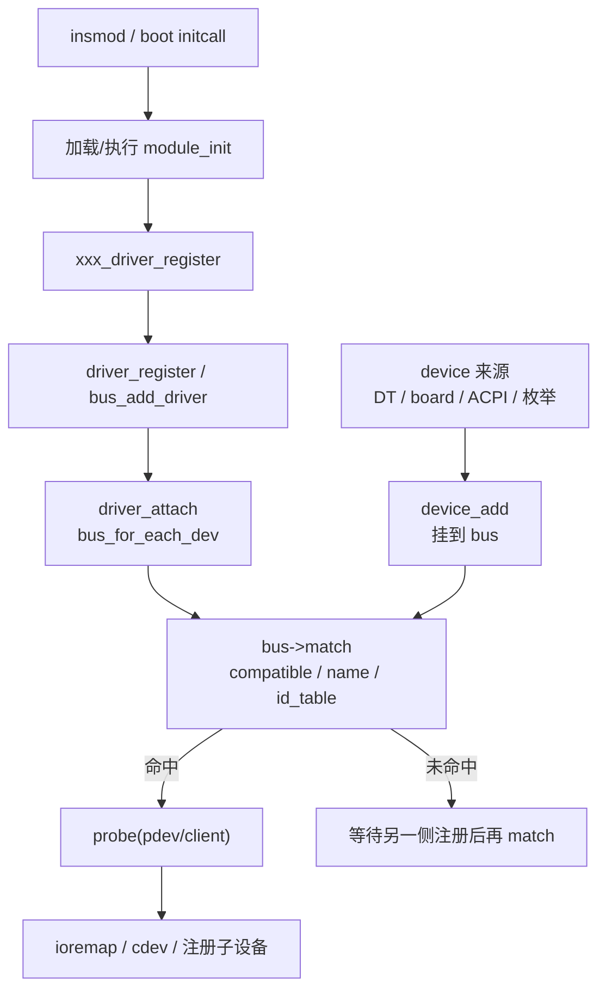

# Linux 驱动加载与匹配 — 面试问答

> 适用：驱动 / 内核 / 嵌入式 Linux 岗位  
> 结构：每题含 **口头答案**（20–40 秒可讲完）+ **关键点** + **易被追问处**  
> 编号：1–11

---

## 速记总览

| 题号 | 一句话结论 |
|------|------------|
| 1 | insmod → 系统调用 → load_module → 执行 module_init → 注册驱动 → bus match → probe |
| 2 | 入口是 `xxx_init`；module_init 只注册，匹配在 driver_register → driver_attach 里发生 |
| 3 | 不会直接调 probe；init 里只做注册，硬件初始化放 probe |
| 4 | 只遍历**本 bus** 上已有 device，不是整棵设备树、也不是全系统设备 |
| 5 | platform = SoC 片上外设；对应虚拟总线 platform_bus + platform_device |
| 6 | 控制器常是 platform；I2C 从设备是 i2c_driver，不是 platform_driver |
| 7 | 都走 driver_register；差别在 bus、device 结构、匹配条件和 IO 方式 |
| 8 | 只匹配 platform bus 上且命中 of_match/id_table/name 的 device |
| 9 | 不一定；DT 节点也可对应虚拟设备，或写了但硬件未贴 |
| 10 | 设备模型不依赖 DT；DT 只负责创建 device + 填资源 + 提供 compatible |
| 11 | platform = 「某硬件平台上的片上设备」，用虚拟总线统一挂接 |

**硬结论三条：**
1. `module_init` 不直接调 `probe`，只负责注册。  
2. 只匹配本 bus 上符合驱动 match 表的 device。  
3. 设备模型不依赖设备树；DT 是 device 与资源的一种来源。

---

## 1. 请介绍 Linux 内核驱动从 insmod 开始的加载全流程

### 口头答案

insmod 把 `.ko` 通过 `init_module`/`finit_module` 系统调用交给内核。模块加载器校验 ELF 与 vermagic，解析依赖和符号，把代码拷进内核空间并完成重定位，再调用模块入口 `module_init` 注册的函数。入口里一般调用 `platform_driver_register` 等把驱动挂上总线；总线对已有 device 做 match，成功则调 probe。若设备已存在，insmod 返回前 probe 可能已经完成。

### 关键点

```text
insmod
  → syscall init_module / finit_module
  → kernel/module：load_module（校验、拷贝、重定位、符号）
  → do_init_module()
  → 你的 xxx_init（module_init 注册的）
  → platform_driver_register / i2c_add_driver ...
  → driver_register → bus_add_driver → driver_attach
  → bus_for_each_dev → bus->match
  → probe(pdev / client)
```

- `modprobe` 会先按 `.modinfo` 加载依赖模块  
- `rmmod` → `module_exit` → `driver_unregister` → `remove`

### 易被追问

- vermagic 是什么？→ 内核版本/架构/配置签名，不匹配拒绝加载  
- probe 为什么有时在 insmod 期间就跑完？→ 设备已挂上 bus，register 时同步 attach  
- built-in 驱动怎么加载？→ 变成 device_initcall，开机 do_initcalls 按优先级调用

---

## 2. 驱动加载时入口函数在哪里？module_init 是怎样走到设备匹配的？

### 口头答案

入口是你写的 `static int __init xxx_init(void)`，用 `module_init(xxx_init)` 注册后，函数地址写入 `struct module->init`，由 `do_init_module()` 调用。module_init 本身不做匹配；匹配发生在你调用的 `*_driver_register` 里：`driver_register` → `bus_add_driver` → `driver_attach` → `bus_for_each_dev` → 总线 `match` → 成功则 `probe`。

### 关键点

```c
static int __init my_drv_init(void)
{
    return platform_driver_register(&my_pdrv);
}
module_init(my_drv_init);
```

```text
module_init(xxx_init)
  → do_init_module 调用 xxx_init
  → platform_driver_register
  → driver_register → bus_add_driver → driver_attach
  → bus_for_each_dev(bus, __driver_attach)
  → driver_match_device → bus->match
  → driver_probe_device → drv->probe
```

### 易被追问

- built-in 的 module_init 去哪了？→ 展开为 initcall，开机早期执行  
- match 不成功会怎样？→ 驱动留在 bus 上等待后续 device；device 侧 device_add 时也会再触发 match

---

## 3. module_init 会直接调用 probe 吗？module_init 函数里实际应该做什么？

### 口头答案

**不会直接调用 probe。** probe 是总线在 match 成功后由内核框架调用的，不是 init 手动调用。module_init 里应只做**注册**：`platform_driver_register`、`i2c_add_driver`、必要时创建 class/proc 等全局资源。与单个设备相关的初始化放 probe，释放放 remove。

### 关键点

| 应该做 | 不要做 |
|--------|--------|
| 注册 driver / cdev / misc / class | 在 init 里手写硬件初始化 |
| 返回正确的错误码 | 大块阻塞操作（卡住 insmod/initcall） |
| 申请驱动级全局资源 | 依赖尚未创建的 device（应放 probe） |

原则：**init = 挂进设备模型；probe = 与具体设备绑定后的初始化。**

### 易被追问

- 有时 insmod 后立刻看到 probe 日志？→ 不是 init 直接调的，是 register 过程中 attach 触发  
- init 失败要注意什么？→ 逆序注销已注册资源，返回非 0

---

## 4. 注册 driver 时会遍历设备树解析出来的所有 device 吗？匹配范围是什么？

### 口头答案

**匹配范围是该驱动所属 bus 上的全部 device**，不是整棵设备树，也不是全系统设备。`platform_driver_register` 只遍历 platform bus；`i2c_add_driver` 只遍历 i2c bus。设备树节点经 `of_platform` 生成的 platform_device 会挂在 platform bus 上，因此会被 platform 驱动看到；i2c_client、usb_device 等则不会。

### 关键点

```text
遍历集合 = driver->bus 上当前存在的 device 列表
过滤条件 = of_match_table / id_table / driver->name
```

- 可见：所有已创建的 platform_device（DT 解析 + 板级/ACPI 等）  
- 不可见：其它 bus 上的对象（i2c_client、spi_device、pci_dev…）

### 易被追问

- 设备树里的 i2c 从设备会被 platform_driver 匹配吗？→ 一般不会，它变成 i2c_client，挂在 i2c bus  
- 一个驱动能否绑多个设备？→ 可以，compatible 相同的多个节点各触发一次 probe

---

## 5. platform driver 是什么？它和什么对象或总线对应？对应哪些硬件？为什么这么叫？

### 口头答案

platform driver 是挂在 **`platform_bus_type`** 上的驱动，对应设备对象是 **`platform_device`**。它对应的是 **SoC 片上外设和板级固定外设**：UART/I2C/SPI/GPIO/PWM 等控制器、clock/pinctrl/interrupt controller、DMA 等——地址和中断在芯片手册里固定，**不能像 USB/PCI 那样协议枚举**。  
名字里的 platform 指「硬件平台（芯片+板子）」：这些设备没有真实可枚举总线，内核用一条**虚拟总线**把它们统一挂起来做 match/probe。

### 关键点

| 概念 | 内核对象 |
|------|----------|
| 总线 | `platform_bus_type`（虚拟总线） |
| 设备 | `struct platform_device`（MMIO + IRQ 资源） |
| 驱动 | `struct platform_driver`（probe/remove/PM） |

**是 platform 的典型硬件：**
- SoC 片上控制器：UART 控制器、I2C/SPI 控制器、GPIO、PWM、WDT、RTC、DMA  
- 系统模块：clock、pinctrl、GIC、power domain、reset、syscon、nvmem  
- 板级固定外设：板载 LED/按键、fixed-regulator（也常是虚拟节点）

**不是 platform 的：**
- I2C/SPI 从设备（传感器等）→ i2c_driver / spi_driver  
- USB/PCI 设备 → usb_driver / pci_driver  

**为什么叫 platform：**
- 历史：早期 ARM 用 board file 描述「这块平台上有哪些外设」  
- 这些外设无标准发现机制，只能静态声明（DT / board code）  
- 内核引入 platform bus 作为**软件归类用的虚拟总线**，与真实协议总线区分  

一句话：**platform = 「属于当前芯片/板级平台的片上设备」；地址平台定，发现靠声明，通信直接 MMIO/IRQ。**

### 易被追问

- 和 PCI 的最大区别？→ PCI 有配置空间、可枚举、可热插拔；platform 全靠声明  
- I2C 控制器和 I2C 传感器谁是 platform？→ 控制器是；传感器不是  
- probe 里怎么拿地址？→ `platform_get_resource` / `devm_ioremap_resource`，或 regmap

---

## 6. 除了 platform driver 还写过什么驱动？I2C 设备、UART 设备也是 platform driver 吗？

### 口头答案

（请按自己的真实项目替换例子）常见类型还有：i2c_driver（传感器/触摸/外接 RTC）、spi_driver、USB/PCI 驱动、misc/cdev 字符设备等。  
**不能一概而论：** SoC 里的 **I2C 控制器、UART 控制器**通常是 platform_driver；挂在 I2C 总线上的**从设备**是 i2c_driver，不是 platform_driver。UART 字符设备 `/dev/ttyS*` 往往由 TTY/serial 子系统注册，底层控制器 probe 仍可能是 platform 或 8250 这类 serial driver。

### 关键点

```text
I2C 控制器（片上 master）  →  platform_device + platform_driver
I2C 从设备（板上传感器）    →  i2c_client + i2c_driver

SoC UART 控制器            →  常为 platform（或 serial 框架下驱动）
USB-UART 芯片              →  usb_driver
/dev/ttyS*                 →  TTY 层字符设备
```

### 面试答法示例

> 我写过 platform 驱动，对应 SoC 的 XX 控制器；也写过 i2c_driver，对应 XX 传感器。控制器和从设备不是一回事：控制器用 platform 注册，从设备用 i2c_add_driver，在 i2c 总线上 match。

### 易被追问

- 设备树里传感器节点长什么样？→ 挂在 `i2c@xxx` 下，有 `reg = <地址>` 与 compatible  
- 一个传感器驱动为何也能同时支持 platform 传输？→ 有的用 regmap + 多种 bus 适配，但主流仍以 i2c_driver 为主

---

## 7. i2c_register_driver 和 platform_driver_register 有什么区别？

### 口头答案

两者在设备模型层同构，都走 `driver_register` → 总线 match → probe；差别在 **挂哪条 bus、设备结构、匹配条件和 IO 方式**。i2c 注册的是 `i2c_driver`，设备是 `i2c_client`（有 7-bit 地址），probe 后用 `i2c_transfer`/SMBus 访问；platform 注册的是 `platform_driver`，设备是 `platform_device`（reg/IRQ），驱动直接操作 MMIO 寄存器。

### 关键点

| 维度 | i2c_add_driver / i2c_register_driver | platform_driver_register |
|------|--------------------------------------|---------------------------|
| Bus | `i2c_bus_type` | `platform_bus_type` |
| 驱动结构 | `struct i2c_driver` | `struct platform_driver` |
| 设备对象 | `struct i2c_client` | `struct platform_device` |
| 匹配依据 | of_match / id_table / 名字；常含 adapter+地址 | of_match / id_table / 名字 |
| probe 参数 | `probe(struct i2c_client *)` | `probe(struct platform_device *)` |
| 典型硬件 | 传感器、从设备芯片 | SoC 片上控制器 |
| 访问方式 | i2c_smbus_* / i2c_transfer | ioremap / regmap MMIO + IRQ |

### 易被追问

- i2c 驱动如何拿到总线与地址？→ `client->adapter`、`client->addr`，设备树 `reg`  
- 为何有的传感器能同时挂在 platform 和 i2c？→ 少数用 regmap 抽象多种总线，但注册入口仍是对应 bus 的 add_driver

---

## 8. 注册 platform driver 时，是否要匹配所有设备？到底匹配哪些设备？

### 口头答案

**不需要、也不会匹配系统里所有设备。** 只匹配 **platform bus 上、且命中驱动匹配表的 device**：`of_device_id`（compatible）、`platform_device_id`、或 `driver.name`。其它 bus、或 compatible 不一致的 device 都会跳过。

### 关键点

```text
匹配集合 = platform_bus 上的 device
         ∩ (of_match_table 命中 ∪ id_table 命中 ∪ name 匹配)
```

例：

```dts
compatible = "vendor,soc-uart";  /* uart0、uart1 → 会 match */
compatible = "vendor,soc-i2c";   /* i2c0 → 不 match 这个 UART 驱动 */
```

一个 driver 可绑多个同 compatible 的 device，每个各触发一次 probe。

### 易被追问

- match 成功但 probe 失败？→ 可能是资源/版本检查在 probe 里返回 -ENODEV，驱动仍留在 bus 上  
- 设备后注册会怎样？→ device_add 时总线再次对所有 driver 做 match

---

## 9. 设备树里写的节点一定对应真实硬件吗？

### 口头答案

**不一定。** 设备树描述的是「软件可见的设备/资源拓扑」。节点可能是真实片上外设，也可能是虚拟/软件设备（fixed-regulator、gpio-leds、simple-framebuffer），或纯描述性节点（reserved-memory、时钟/复位）。也可能 compatible 写了但芯片未贴，导致 probe 失败。

### 关键点

| 节点类型 | 是否真实硅片 | 例子 |
|----------|--------------|------|
| 真实外设 | 是 | uart@xxx、i2c@xxx |
| 系统/描述节点 | 半真实/否 | reserved-memory、clocks |
| 虚拟/软件设备 | 否 | fixed-regulator、gpio-keys |
| 配置错误 | 写了但硬件不在 | compatible 在、芯片未贴 → probe 失败 |

反向也成立：**真有硬件但 DT 没写/compatible 不对，系统一般不会自动创建 device**（USB/PCI 等可枚举总线除外）。

DT 节点的含义是：**请内核按此创建 device 并尝试匹配驱动**，不等于电气上一定存在。

### 易被追问

- 如何确认节点是否对应硬件？→ 看 compatible 是否绑定驱动、reg 是否有效、probe 是否成功、是否有原理图/手册  
- 虚拟节点有用吗？→ 有用，用于统一 regulator/leds/gpio 等软件接口

---

## 10. 不使用设备树时，Linux 设备模型、probe 和匹配机制如何生效？设备树承担什么作用？

### 口头答案

**设备模型不依赖设备树。** 没有 DT 时，device 仍可由 board file、驱动模块内 `platform_device_register`、ACPI 或总线枚举（USB/PCI）创建。只要 device 挂在 bus 上、driver 声明了匹配条件，`driver_register` 与 `device_add` 谁后到都会触发 match → probe。  
设备树的作用是：**声明式描述硬件，自动创建 device，填充 reg/IRQ/clock 等资源，并提供 compatible 作为标准匹配键**，实现「换板主要改 DTB、尽量不改驱动」。

### 关键点

```text
device 来源（无 DT）：
  board file 手工注册
  驱动内 platform_device_alloc/add
  ACPI / PCI / USB 枚举

匹配机制（与 DT 无关）：
  device + driver 挂 bus → bus->match → probe
```

**设备树真正承担：**

| 作用 | 说明 |
|------|------|
| 创建 device | of_platform_populate 把节点变成 platform_device/i2c_client |
| 填充资源 | reg、interrupts、clocks、pinctrl、gpio |
| 提供 match 键 | compatible ↔ of_match_table |
| 描述拓扑 | 父子总线（i2c 下挂 sensor） |
| 板级差异外置 | 数据与驱动代码分离 |

一句话：**设备模型是内核通用机制；DT 是在 ARM 等平台上创建 device 并提供资源/compatible 的主要方式，去掉 DT 换成 board file，match/probe 链路几乎不变。**

### 易被追问

- 旧 ARM 怎么注册 UART？→ board file 里 `platform_device` + resource，machine init 时 register  
- 为何现在主流用 DT？→ 同一驱动适配多板，DTS/DTSI 可维护性远好于 board file  
- ACPI 和 DT 关系？→ 角色类似（描述硬件并创建 device），体系不同（x86 主流 ACPI）

---

## 11. platform driver 究竟对应什么？

### 口头答案

platform = **「某硬件平台上的片上设备」**。这类外设地址/中断固定、无法像 USB/PCI 那样被协议枚举，内核用虚拟总线 `platform_bus` 统一挂接 `platform_device` 与 `platform_driver`，用 compatible/name 做 match → probe。

### 关键点

- 对应硬件：SoC 片上控制器 + 板级固定外设  
- 发现方式：DT / board file / ACPI **声明**，不是总线扫描  
- 访问方式：MMIO + IRQ（或 regmap）  
- 与第 5 题同源，口试可合并作答

---

## 综合因果链（背这张图）



---

## 高频追问一览

| 追问 | 答法 |
|------|------|
| module_init 能写硬件初始化吗？ | 不建议；放 probe。init 只注册 |
| 为何 insmod 后设备立刻能用？ | register 时对已有 device 同步 match+probe |
| platform 总线是真实物理总线吗？ | 不是，是软件虚拟总线 |
| 同一 compatible 多个节点会怎样？ | 一个 driver，多个 device，各 probe 一次 |
| DT 节点 probe 一定成功吗？ | 不一定；资源/硬件/依赖都可能导致失败 |
| 驱动没 match 到设备算失败吗？ | 通常不算；注册成功即可，等设备出现 |
| rmmod 为何有时失败？ | 设备在使用中（引用计数）、符号依赖等 |
| built-in 和 .ko 的 init 区别？ | built-in 走 initcall 按级别启动时执行；.ko 由用户态 insmod/modprobe 触发 |

---

## 口试 60 秒版（连问连答）

**Q：从 insmod 到 probe？**  
A：insmod 走 init_module，内核 load_module 校验加载后调 module_init；init 里 register 驱动；driver_attach 遍历本 bus 上 device，compatible/name 匹配成功就 probe。

**Q：module_init 直接调 probe 吗？**  
A：不直接调。init 只注册；probe 由总线在 match 成功后回调。

**Q：platform 是什么？**  
A：对应 SoC 片上固定外设，挂虚拟 platform_bus，设备是 platform_device，靠 DT/board 声明，不靠协议枚举。

**Q：I2C 传感器是 platform 吗？**  
A：不是。I2C 控制器是 platform；传感器是 i2c_driver，挂在 i2c bus 上用地址通信。

**Q：没有设备树还行吗？**  
A：行。设备模型 match/probe 不依赖 DT；DT 负责创建 device、填资源、给 compatible。

---

## 复习建议

1. **先背三条硬结论**，再背 insmod → probe 一条链。  
2. **用「控制器 vs 从设备」区分 platform 与 i2c/spi**，这是最高频陷阱题。  
3. 说明时主动提：**匹配范围 = 本 bus ∩ 匹配表**，显得边界清晰。  
4. 结合自己的项目：说清「我注册的是哪种 driver、match 依据是什么、probe 里做了什么」。
5. 本题库与 [[计划-独立线-Linux通用内核机制]] 的 **K2 设备模型** 直接对应，可当 K2 验收口试题。

---

## 关联

- [[计划-独立线-Linux通用内核机制]]（K2 / G2）
- [[MOC-Linux]]、[[学习-Linux-学习路线]]
- [[学习-Linux-驱动开发-AD9361-从dtsi到驱动调用流程]]（SPI vs platform 实例）
- [[Home]]
